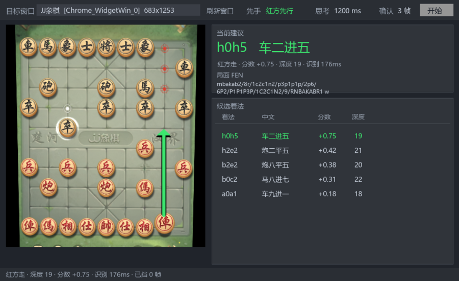

# XiangQiLens · 象棋屏幕识别与引擎分析

把棋盘从屏幕里"读"出来，交给象棋引擎分析，**在棋盘上画出推荐走法箭头**。

面向在线对局（微信小程序、桌面客户端等）的辅助分析工具：截取目标窗口画面 →
定位棋盘 → 识别 90 个交叉点的棋子 → 重建局面 → Pikafish 分析 → 显示最佳着法与候选变化。

**不含自动走子**：只给建议，落子由你自己操作。



---

## 特性

| 能力 | 说明 |
|---|---|
| **后台截图** | 用 `PrintWindow` + `PW_RENDERFULLCONTENT` 截取窗口，**不要求窗口可见、可被遮挡**；失败时自动回退到屏幕抓取 |
| **棋盘识别** | 两段式 ONNX：棋盘 4 角定位（pose）→ 透视拉正 → 90 格分类 |
| **走法箭头** | 直接画在棋盘上：绿色粗箭头是最佳着法，蓝色细箭头是候选变化 |
| **中文着法** | `h2e2` → `炮二平五` |
| **轮次推断** | 识别只能看局面、看不出轮到谁走，用局面差分 + 引擎着法合法性自纠推断 |
| **四道识别闸门** | 见下文「识别流水线」，任何一道不过都不会把垃圾局面送进引擎 |
| **失败可见** | 左栏显示识别程序**实际看到的棋盘**，出问题一眼能看出是哪里错 |

---

## 快速开始

### 1. 环境

需要 Python 3.10+（开发环境为 3.13）。推荐用 DirectML 版 onnxruntime 走 GPU：

```bash
pip install PySide6 opencv-python numpy mss pywin32 cchess
pip install onnxruntime-directml     # Windows + 任意显卡；纯 CPU 用 onnxruntime
```

> **性能差异很大**：默认的 `onnxruntime` 是 CPU 版，即使代码里请求 CUDA 也会静默降级。
> 实测识别耗时 CPU 版约 980ms/帧，DirectML 版约 170ms/帧。详见下文「性能」。

### 2. 下载模型与引擎

这两项体积较大且各有许可证，未纳入版本库。

**识别模型**（来自 [Chinese_Chess_Recognition](https://huggingface.co/spaces/yolo12138/Chinese_Chess_Recognition)，MIT）：
从 HuggingFace Space 下载两个 ONNX 权重，放到指定位置：

```
xq_research/hf_model/onnx/pose/4_v6-0301.onnx                 # 棋盘 4 角定位，约 10MB
xq_research/hf_model/onnx/layout_recognition/nano_v3-0319.onnx # 90 格分类，约 30MB
```

**Pikafish 引擎**（[官方发布](https://github.com/official-pikafish/Pikafish/releases)，GPL-3.0）：

```bash
# 下载后解压，把 exe 与 nnue 权重放到同一目录
xq_research/pikafish/Pikafish-Windows-x86-64-universal.exe
xq_research/pikafish/pikafish.nnue
```

也可以用仓库里的 `tools/setup_engine.py` 自动完成这一步（会校验 CPU 指令集并跑一次真实搜索验证）：

```bash
python tools/setup_engine.py
```

### 3. 运行

```bash
python app_vision.py
```

1. 把对局窗口开到棋盘可见
2. 在「目标窗口」下拉框里选**棋局窗口本身**（如 `JJ象棋 [Chrome_WidgetWin_0]`），
   不要选整个聊天/宿主窗口 —— 棋盘占比太小会导致角点定位失败
3. 按当前轮到谁走设置「先手」
4. 点「开始」

自检（不启动界面，验证环境是否正常）：

```bash
python app_vision.py --selftest
```

---

## 识别流水线

每帧识别结果要依次通过四道闸门，任何一道不过都不会送进引擎：

| # | 闸门 | 检查内容 | 为什么需要 |
|---|---|---|---|
| 1 | **棋盘几何校验** | 四角构成的四边形：边长、宽高比、面积占比 | pose 模型在**画面里没有棋盘时也会输出 4 个点**，且常退化成一条线。实测在 JJ象棋 主界面的 3D 棋盘摆件上，输出四角的 y 只差 18px |
| 2 | **局面严格校验** | 将帅各一、各兵种数量上限、将帅在九宫、将帅不照面、总子数 ≤ 32 | `cchess` 对缺子/多子局面很宽松，实测会接受「两个黑将、没有红帅」；而 Pikafish 遇到非法局面**直接退出进程** |
| 3 | **棋规校验** | 用 `cchess` 构造并生成合法着法 | 兜住闸门 2 未覆盖的规则 |
| 4 | **演化校验** | 新局面必须能由上一局面走**一步合法着法**得到 | 挡住单帧误识别。不满足时暂存为候选，连续两帧一致才采信；连续 6 帧仍无法解释则兜底采信（避免卡死）并提示 |

其中闸门 4 是提升可用性的关键 —— 单帧把红傌读成红炮这类错误，一旦采信整局分析都会跑偏。

```
帧1: 采信(初始局面)   红方走  建议 b2e2 炮八平五
帧2: 挡下(drop)      ← 识别飘了，被挡住
帧3: 采信(稳定新局面)  红方走  建议 b0c2 马八进七
帧4: 采信(走子)       黑方走 ← 轮次正确翻转
帧5-6: 挡下(drop)
护栏: 已挡 3 帧 · 着法序列 ['b2d2']
```

---

## 性能

识别性能关键在 **execution provider**。实测（JJ象棋窗口 683×1253）：

| 配置 | pose | cls | 推理合计 | 完整单帧 |
|---|---|---|---|---|
| `onnxruntime`（CPU 版） | 13.8ms | **872.5ms** | 885.7ms | 979ms |
| `onnxruntime-directml` | **4.1ms** | **128.0ms** | **132.3ms** | **170ms** |

DirectML 版还显著更稳：CPU 版 p90/中位 = 1.35（偶发 1170ms 尖峰），DirectML 版 1.06（实测 120~154ms）。

> 首帧有约 **3 秒预热**（DirectML 编译着色器），之后才进入稳定速度。

确认当前用的哪个 provider：

```bash
python tools/bench_vision.py --runs 20
```

---

## 项目结构

```
XiangQiLens/
├── app_vision.py              GUI（界面与调度）
├── app_backend.py             后端：截图 / 识别 / 引擎 / 棋规 / 四道闸门
├── 启动XiangQiLens.vbs         无窗口启动器（桌面快捷方式指向它）
│
├── tools/                     诊断与验证脚本，见下表
│
└── src/                       另一套自研识别实现（探索性质，保留作为参考）
    ├── xiangqi.py             棋盘表示、FEN 转换、规则校验
    ├── capture.py             窗口枚举、后台截图、DPI 坐标换算
    ├── vision.py              网格定位 + 棋子颜色/模板分类
    └── engine.py              UCI 引擎封装
```

`app_*` 用的是**现成两段式模型**（精度更高，红方双俥双傌全部正确）；
`src/` 是早期自研路线（几何 + 颜色判据 + 模板匹配），网格对齐精度未完善，保留供参考。

### 工具脚本

| 脚本 | 用途 |
|---|---|
| `setup_engine.py` | 解压 Pikafish、按 CPU 指令集选二进制、跑真实搜索验证 |
| `bench_vision.py` | 识别性能基准 + 检查 execution provider |
| `diagnose_live.py` | 对当前窗口做一次识别，输出棋盘还原与置信度 |
| `test_e2e.py` | 端到端：抓帧→识别→闸门→轮次→引擎 |
| `test_guard.py` | 抗错状态机与轮次管理单元测试（7 个场景） |
| `test_position.py` | 局面严格校验单元测试（14 个用例） |
| `test_geometry.py` | 棋盘几何校验单元测试（9 个用例） |
| `test_arrow.py` | 走法箭头坐标验证 + 渲染预览 |
| `stress_test.py` | 连续多帧稳定性与内存压力测试 |
| `probe_windows.py` | 窗口枚举与后台截图能力探测 |
| `analyze_board.py` / `detect_lines.py` / ... | 自研路线的调参与诊断工具 |

---

## 实现要点

**坐标系统一**：进程启动即设 Per-Monitor V2 DPI 感知。不做这一步，高缩放下
`GetWindowRect` / 截图坐标会整体差 1.5 倍。

**后台截图**：`PrintWindow` 必须带 `PW_RENDERFULLCONTENT (0x2)`，否则 CEF / DirectX
渲染的窗口（微信小程序、Electron 应用）会截出空白图。

**箭头坐标**：由着法的 ICCS 坐标经识别所用透视矩阵反算，与棋盘像素级贴合。
`h0h5` 换算结果 `from=(356.25,450.00) to=(356.25,227.78)`，实测起止点均落在棋子中心。

**轮次推断**：识别产物只有局面、没有"轮到谁走"这一位信息。两条途径补齐 ——
局面差分推进（相邻局面恰好差一步合法着法则翻转轮次），以及引擎着法合法性自纠
（Pikafish 只从当前行棋方视角给着法，若其着法仅对另一方合法则说明轮次设错）。

---

## 已知限制

- **识别会偶发出错**。模型在个别棋子/皮肤上会误判（例如把红傌读成红炮）。闸门 4
  能挡住瞬时错误，但若某次误判连续稳定出现，兜底机制会在 6 帧后采信它。
  判断方法：看左栏显示的棋盘，那就是程序实际"看到"的画面。
- **轮次依赖开局**。从对局中途接手时，初始轮次靠「先手」选项猜，之后靠引擎自纠一次。
- **翻转未做自动适配**。若你执黑（对方在屏幕下方），当前需要手动处理。
- **仅 Windows**。截图与 DPI 部分依赖 Win32 API。

---

## 依赖与许可

本项目的识别与引擎能力**全部复用现成开源组件**，自己实现的是界面、调度与错误防护：

| 组件 | 用途 | 许可 |
|---|---|---|
| [Chinese_Chess_Recognition](https://huggingface.co/spaces/yolo12138/Chinese_Chess_Recognition)（上游 [TheOne1006/chinese-chess-recognition](https://github.com/TheOne1006/chinese-chess-recognition)） | 棋盘定位与 90 格分类模型 | MIT / Apache-2.0 |
| [Pikafish](https://github.com/official-pikafish/Pikafish) | 象棋引擎（UCI） | GPL-3.0 |
| [cchess](https://pypi.org/project/cchess/) | 棋规校验、中文着法、走子 | MIT |
| PySide6 / OpenCV / onnxruntime | 界面、图像处理、推理 | LGPL / Apache-2.0 / MIT |

**注意**：Pikafish 是 GPL-3.0。它以独立进程方式调用（非链接），因此本项目自身
不因此被传染；但若你要分发包含引擎二进制的整包，需遵守 GPL-3.0。

本项目自身代码以 MIT 许可发布，见 [LICENSE](LICENSE)。

---

## 致谢

- [Vincentzyx/VinXiangQi](https://github.com/Vincentzyx/VinXiangQi) —— 象棋连线工具的先驱实现，本项目的窗口截图与整体思路受其启发
- [atopx/chessboard](https://github.com/atopx/chessboard) —— 另一套成熟实现（Rust + Tauri + YOLOv8），本项目的窗口自动选择与取消按钮布局参考了它的交互
- [xiangqiai.com](https://xiangqiai.com/) —— 在线分析工具的交互范式（连线箭头、候选着法列表）

## 免责声明

本工具仅用于个人学习、复盘与棋艺研究。请在使用时遵守对局平台的用户协议，
不要将其用于任何违反平台规则的场景。是否使用及使用后果由使用者自行承担。
